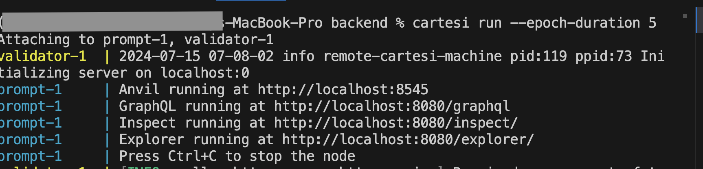

<p align="center">
  
</p>
<h1 align="center">CartDevKit CLI</h1>

<!-- <table>
  <th> Heading 1</th>
  <th> Heading 2</th>
  <tr> 
    <td>
     Hello
    </td>
  </tr>
</table> -->

CartDevKit is an all in one package to help you get started building your project on Cartesi


# System Requirements and Prerequisites
CartDevKit requires Node.js and npm to be installed on your system. Ensure that you have the latest versions of Node.js and npm installed before proceeding with the installation.

# Installation Guide

### Npm Installation:  
To install CartDevKit globally via npm, run the following command:

```bash 
npm install -g cartdevikit
```

Once you have successfully install the package globally on your machine, you are now set to create your first project using the template by running the below command

```bash
npx cartdevikit create myapp
```

Alternatively you can create a project this way without global installation
```bash 
npx cartdevikit@latest create myapp
```
You should see something like this


Replace myapp with the desired name of your project. This command will prompt you to select a template and configure the project settings.

### CLI Options: 
View available command-line options and flags by running  

```bash
cartdevikit --help
```` 

### Backend Setup
If you are interacting with the frontend and backend at the same time. Say you are building a full stack solution. 

Here are the steps:

But if you are only working on the frontend and you are not interacting with the backend you can skip this step.

- First navigate to the backend directory of your created project and run the below command, keep in mind also ensure your docker is all setup and up and running.
   
  ```bash
    cartesi build
  ```
This will help build the image and run the Cartesi machine. Once this step is completed you should see something like this


The next step will be to start the local server by running

```bash
  cartesi run
```
If all goes well you should see this


### Debugging 
For quick troubleshooting incase you run into any issue you can quickly check the status using

```bash
cartesi doctor
```
This will start the development server

### Frontend Setup
If you are working on the frontend, all you need to do is to navigate into the frontend project directory

```bash
npm run dev 
```
or 

```bash
npm start 
```
Depending on the selected template!

### Note 
More details on each individual project setup base on selected template will be provide soon.

# Supported Templates
- Backend (Python, JavaScript, TypeScript, Rust, Go)
- Frontend (React, NestJS, Vue.js, Angular, Sundo Console)
- Cartesify (Backend and Frontend)
- Mobile (React Native with Expo and without Expo, Flutter)


## Template Documentation
Checkout the individual docs to learn more about the template.

### Backend Templates:

CartdevKit supports backend templates in various programming languages, including Python, [JavaScript Template](), [TypeScript Template](), Rust, and Go. Each backend template comes with a basic project structure and configuration files. 


### Frontend Templates

Frontend templates are available for popular frameworks such as [React App Template](), [NestJS Template](), Vue.js, Angular, and Sundo Console. These templates include components, routing, and styling to kickstart front-end development.

### Cartesify Templates
Cartesify templates integrate the Cartesi platform for both backend and frontend development. These templates enable developers to build scalable and secure applications using Cartesi's REST API technology.

The Cartesify template has support for both backend and frontend integration.

- **Frontend** : [React App Template](), [Nextjs App Template]()
- **Backend** : [Javascript Template](), [Typescript Template]()

### Mobile Templates
CartesiKit offers templates for mobile app development using React Native (with and without Expo) and Flutter. These templates include navigation, state management, and UI components for building cross-platform mobile applications utilizing Cartesi's Rollup features.

# Built With
- Cartesi Rollup
- Sunodo
- Deroll/Cartesi Wallet
- Deroll/Cartesi Router
- Cartesify
- Node and Yarn Packages
- Figlet, fs-extra,inquirer, path
  shelljs, child_process,commander
- React, Nextjs, Vuejs and Angular
- JS, TS, Rust, Go and Python

# Official CartesiKit Documentaion
To read a more comprehensive version of this doc visit [here](https://africlab.gitbook.io/cartdevkit)

# Additional Helpful Resources
- [Cartesi Doc]()
- [Sunodo]()

# Contact & Support
Join the Cartesi [Discord]() server. You can also connect with the team here [@africinnovate]()

# Roadmap
See the open issues for a full list of proposed features (and known issues).


# Contributing
We welcome contributions from the community.

# LICENSE
CartdevKit is licensed under the Apache License. Refer to the [LICENSE](https://github.com/gconnect/cartdev-kit/blob/master/LICENSE) file for more details


