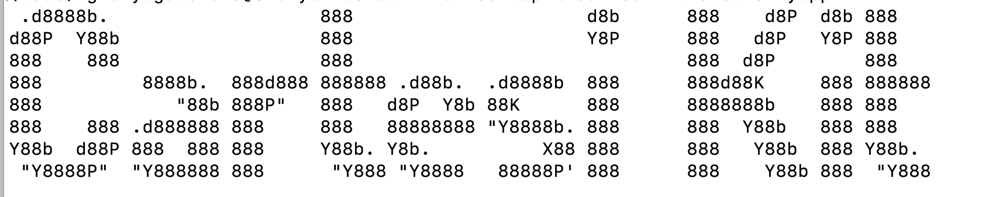

# CartesiKit


An all in one package to help you get started building your project on Cartesi


Building on the blockchain doesn't have to hard. With CartesiKit you are one click away from bringing your ideas to life and launching your product while utilizing the full potentials of the Cartesi Rollup.

The CartesiKit CLI tool is designed to streamline the process of setting up new projects by providing developers with a wide range of templates for backend, frontend, Cartesify, and mobile development.

With the template, you can easily create your frontend and backend project by selecting the template(s) you need in just one click of a command line.

CartesiKit aims to address common challenges faced by developers when setting up new projects or working with various technologies and frameworks.

This project is specially designed to meet the development needs of the Cartesi Developers. It aims to ease the onboarding of new developers into the [Cartesi](cartesi.io) ecosystem.

# System Requirements and Prerequisites
CartesiKit requires Node.js and npm to be installed on your system. Ensure that you have the latest versions of Node.js and npm installed before proceeding with the installation.

# Installation Guide

### Npm Installation:  
To install CartesiKit globally via npm, run the following command:

```bash 
npm install -g cartesikit
```

Once you have successfully install the package globally on your machine, you are now set to create your first project using the template by running the below command

```bash
npx cartesikit create myapp
```

Replace myapp with the desired name of your project. This command will prompt you to select a template and configure the project settings.

### CLI Options: 
View available command-line options and flags by running  

```bash
cartesikit --help
```` 
or 

  ```bash
  cartesikit create --help
  ```

# Supported Templates
A more comprehensive doc for each of the supported templates will be provided soon.
- Backend (Python, JavaScript, TypeScript, Rust, Go)
- Frontend (React, NestJS, Vue.js, Angular, Sundo Console)
- Cartesify (Backend and Frontend)
- Mobile (React Native with Expo and without Expo, Flutter)

## Backend Templates:
CartesiKit supports backend templates in various programming languages, including Python, JavaScript, TypeScript, Rust, and Go. Each backend template comes with a basic project structure and configuration files.

## Frontend Templates
Frontend templates are available for popular frameworks such as React, NestJS, Vue.js, Angular, and Sundo Console. These templates include components, routing, and styling to kickstart front-end development.

## Cartesify Templates
Cartesify templates integrate the Cartesi platform for both backend and frontend development. These templates enable developers to build scalable and secure applications using Cartesi's REST API technology.

## Mobile Templates
CartesiKit offers templates for mobile app development using React Native (with and without Expo) and Flutter. These templates include navigation, state management, and UI components for building cross-platform mobile applications utilizing Cartesi's Rollup features.

# Current Features
The current version of CartesiKit offers a range of powerful features designed to streamline project setup and enhance developer productivity. 

Below are the key features available in this current release:

-  Integration with Cartesi Rollup, Sunodo and Cartesify
-  Project scaffolding
-  Template Selection and Customization
-  Template repository
-  CLI tool integration
-  Documentation and Examples
-  Version Control Integration

# Future Plans
- Improve on UI of the existing templates
- Template expansion
- Create better developer onboarding experience while using the CartesiKit
- Add additional backend code samples
- Add implementation logic for Angular, Vue and on the mobile templates
- Template Updates and Maintenance
- Community Engagement
- Continuous Improvement

# Built With
- Cartesi Rollup
- Sunodo
- Cartesify
- Node and Yarn Packages
- Figlet
- fs-extra
- inquirer
- path
- shelljs
- child_process
- commander

# Official CartesiKit Documentaion
To read a more comprehensive version of this doc visit [here](https://africlab.gitbook.io/cartesikit)

# Contributing Guide
This will be provided soon

# LICENSE
CartesiKit is licensed under the Apache License. Refer to the [LICENSE](https://github.com/gconnect/cartesi-kit/blob/master/LICENSE) file for more details


